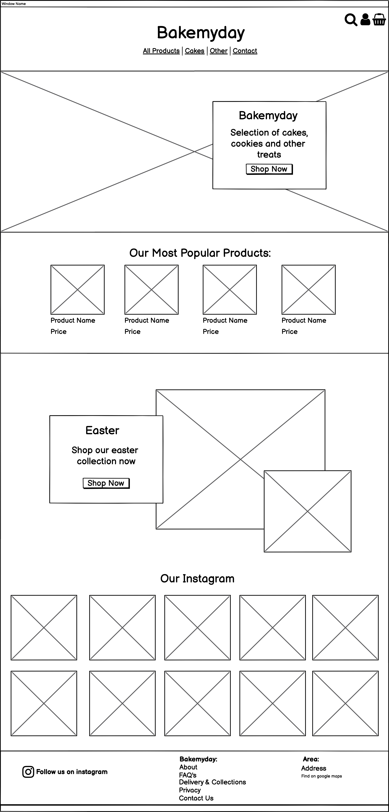
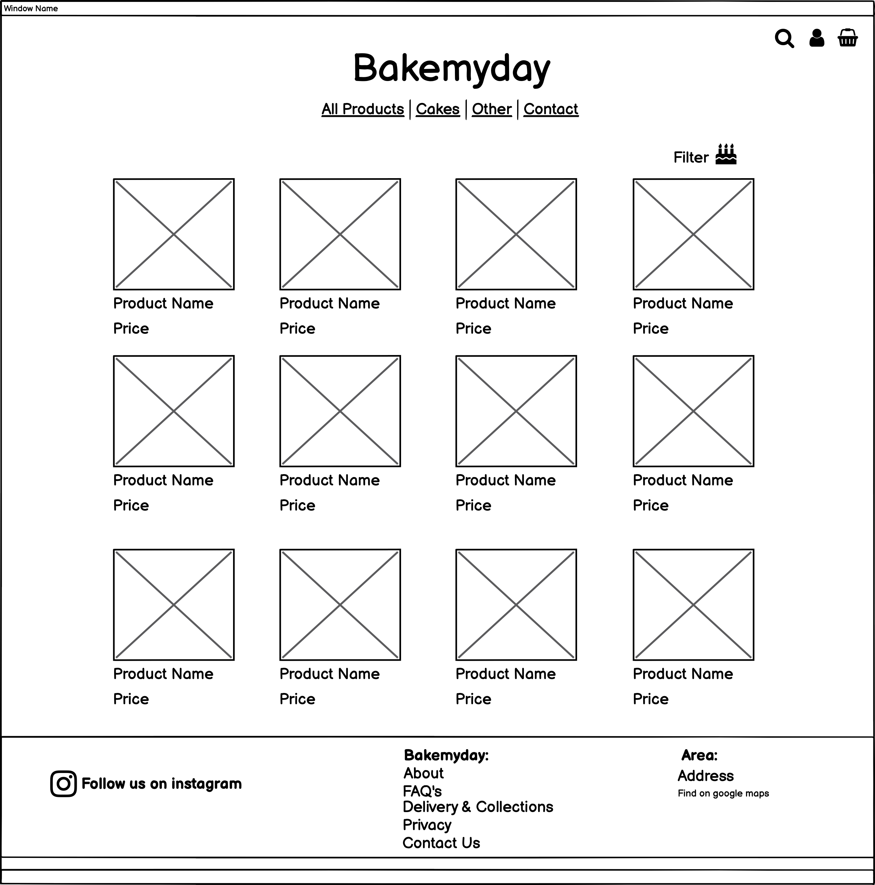
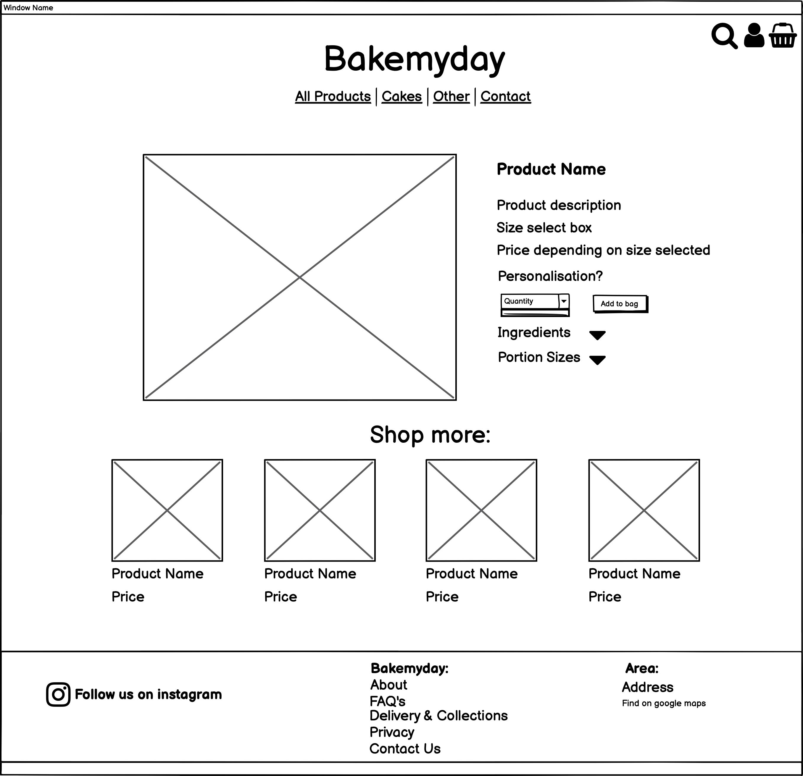
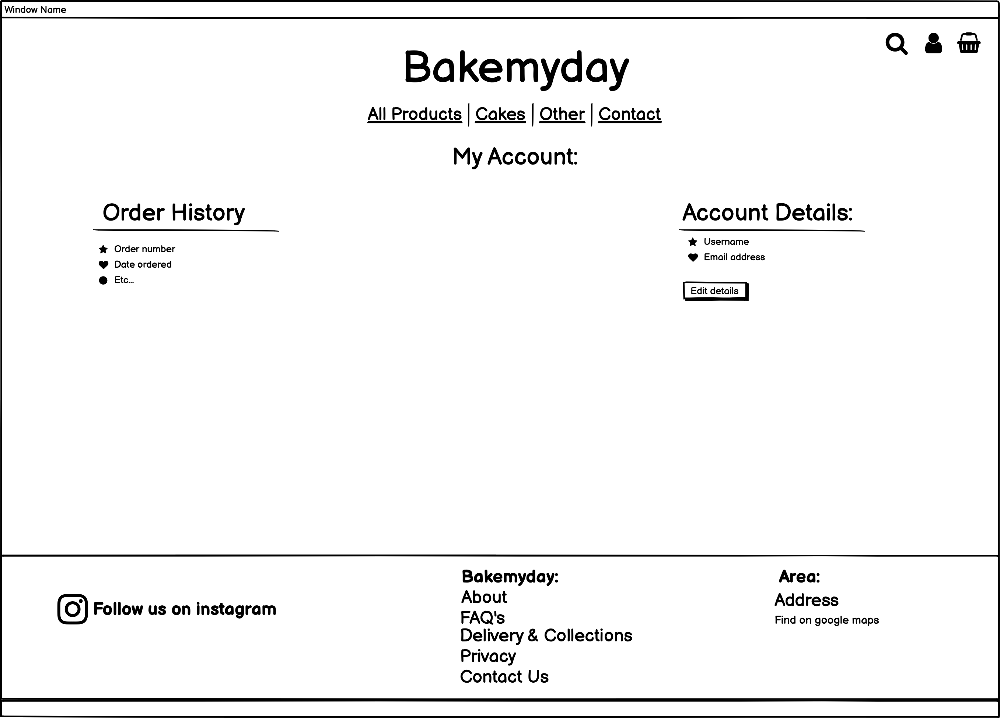
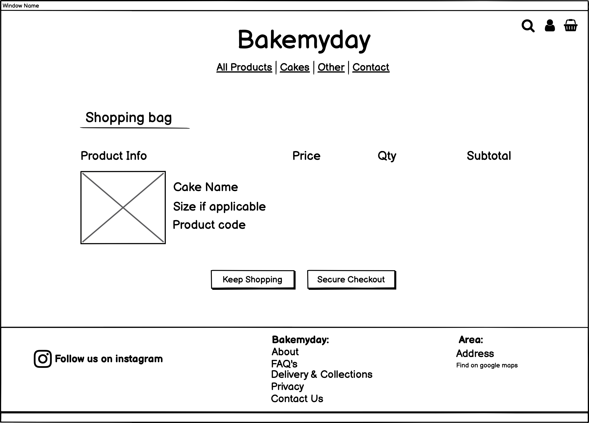
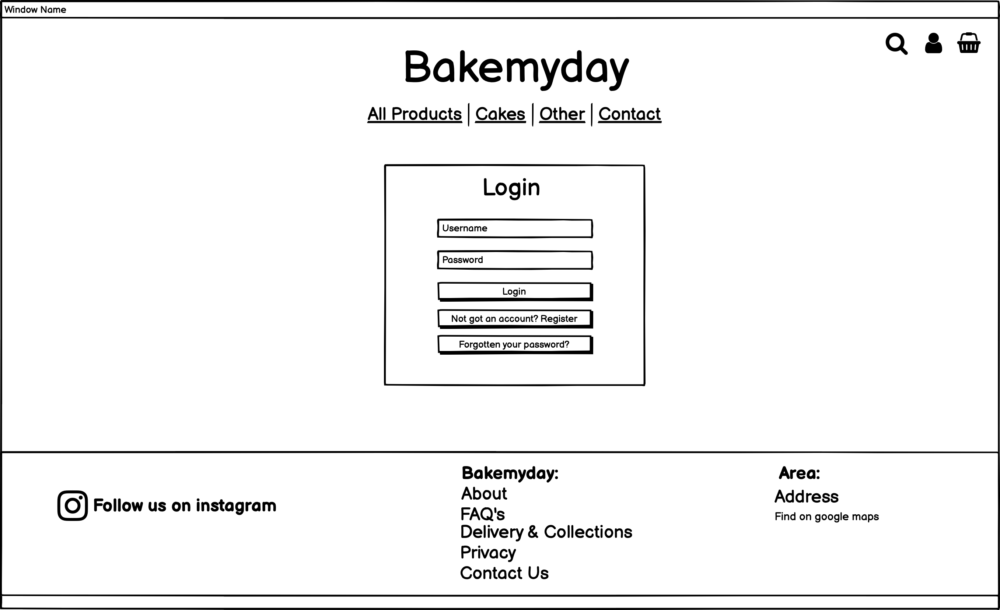
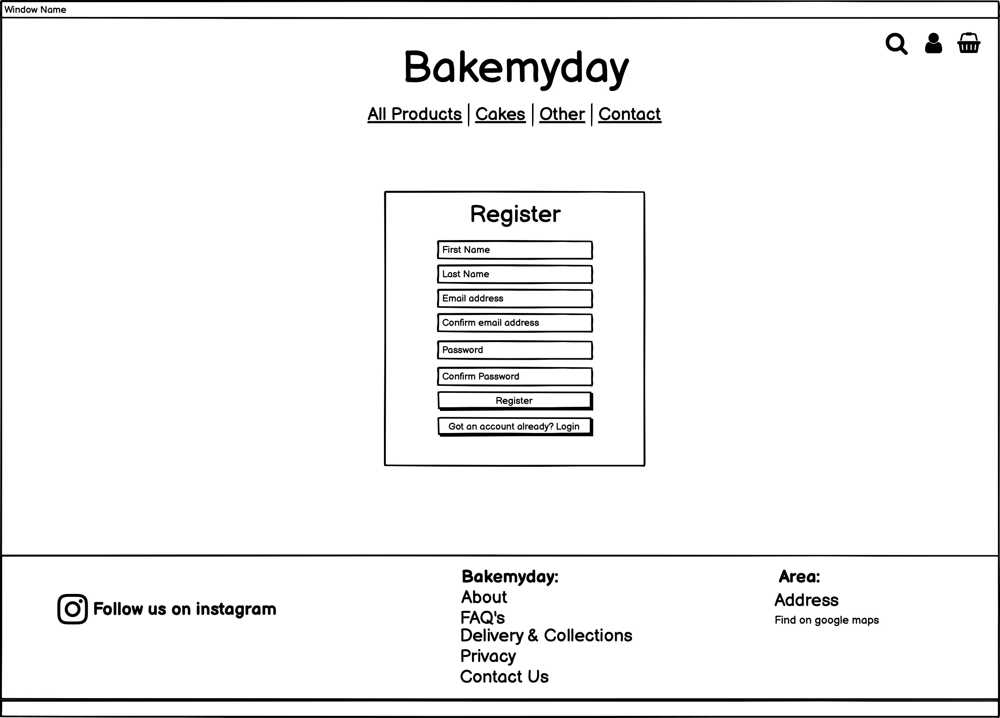
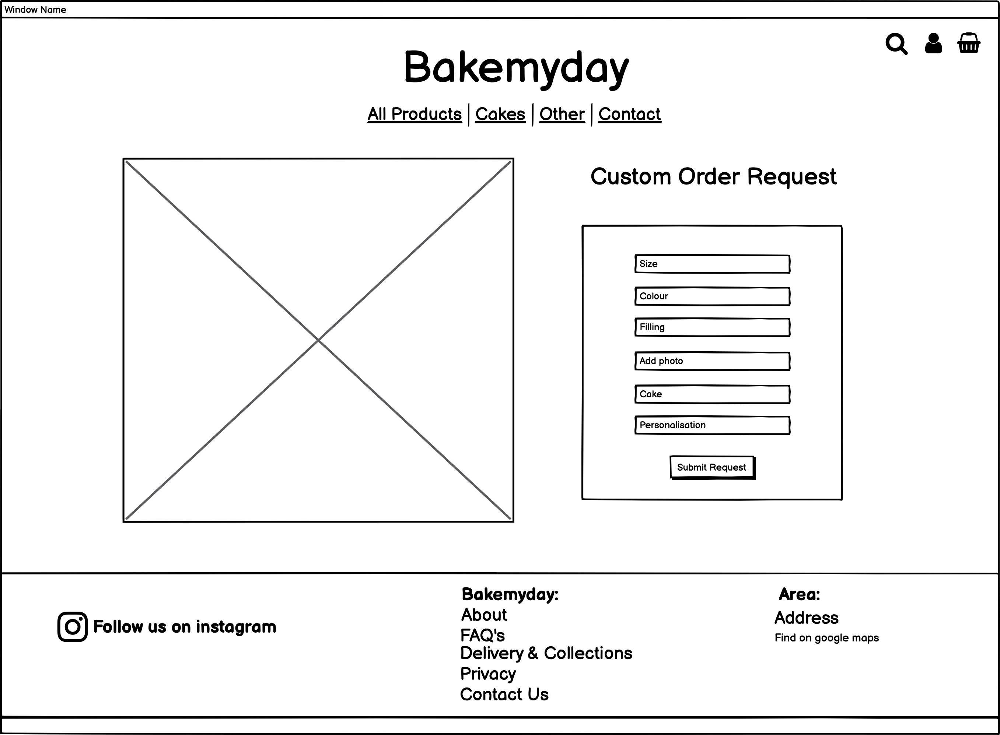
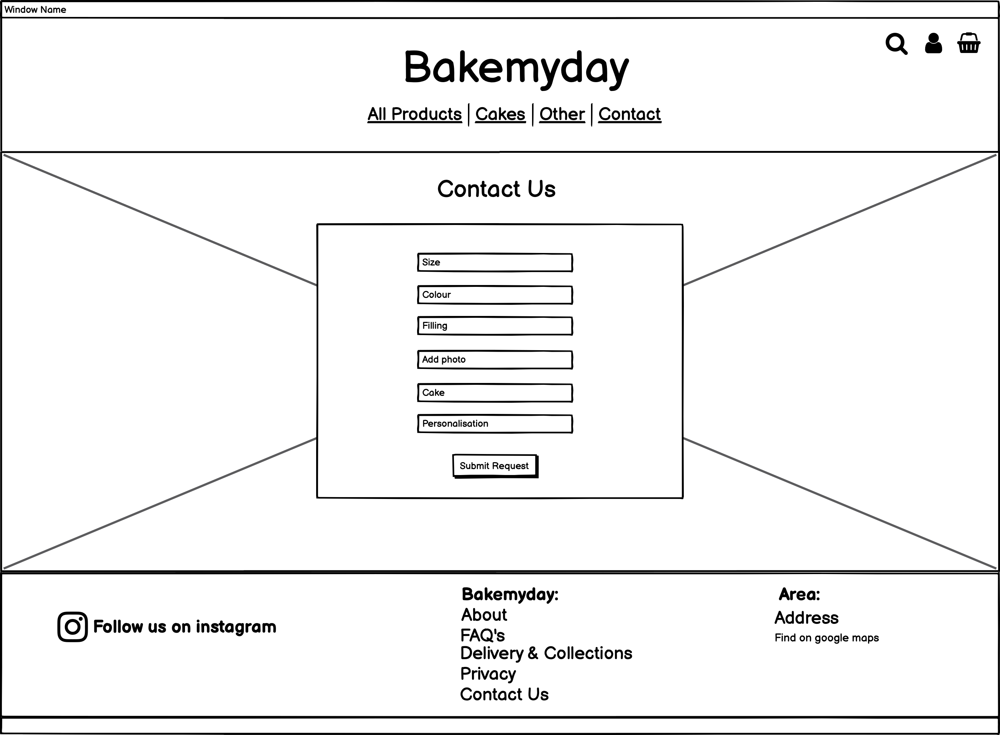

# Bake My Day

[Bake My Day Live Site](https://bakemydaybyamber.herokuapp.com/)

## Table of Index: 
- [UX](#ux)
   - [User Stories](#user-stories)
   - [Wireframes](#wireframes)
   - [Design](#design)
- [Features](#features)
- [Future Features](#future-features)
- [Technologies Used](#technologies-used)
- [Data Schema](#data-schema)
- [Testing](TESTING.md)
- [Deployment](#deployment)
   - [Github cloning](#creating-a-local-repository)
   - [Heroku deployment](#heroku-deployment)
- [Credits](#credits)
 
## UX

## User Stories

### Shopper

- As a shopper on bakemyday I would like to be able to view all products available
- As a shopper on bakemyday I would like to be able to view product details
- As a shopper on bakemyday I would like to be able to sort products by category
- As a shopper on bakemyday I would like to be able identiy if there are any deals on the website
- As a shopper on bakemyday I would like to be able to add product to my basket
- As a shopper on bakemyday I would like to be able to view the product I have added to my basket
- As a shopper on bakemyday I would like to be able to create a personalised order
- As a shopper on bakemyday I would like to be able to personalise my order
- As a shopper on bakemyday I would like to be able to search the website and see my results
- As a shopper on bakemyday I would like to be able to easily select the quantity of what I add to my basket
- As a shopper on bakemyday I would like to be able to sort product by name an description
- As a shopper on bakemyday I would like to recieve email confirmation after I have placed an order

### Site User

- As a site user of bakemyday I would like to easily register for an account
- As a site users of bakemyday I would like to easily login and logout
- As a site users of bakemyday I would to easily recover my password incase I forget it
- As a site users of bakemyday I would like to recieve email confirmation after registering
- As a site users of bakemyday I would like to have a personalized user profile
- As a shopper on bakemyday I would like to be able to view my order history after placing an order

### Site Owner Goals

- As the site owner I want the users to be able to easily navigate across the site and to feel comfortable doing so, easily finding what they want and need. 
- As the site owner I want to be able to easily make any adjustments needed to any products across the website.
- As the site owner I want customers to get a feel for the brand and what it is through the design and layout of the website.
- As the site owner I want customers to not only visit the website but complete orders.
- As the site owner I want customers to feel they can trust the brand by providing them with as much important information as they need.  

## Wireframes

Below are all the wireframes that have been created for bakemyday.

### Homepage (All users):
<details><summary>Desktop </summary>



</details>

<details><summary>Mobile</summary>



</details>

### Products page (All users)

<details><summary>Desktop</summary>


</details>

<details><summary>Mobile</summary>


</details>

### Products detail page (All users)

<details><summary>Desktop </summary>



</details>

<details><summary>Mobile</summary>


</details>

### Profile page (Registered users)

<details><summary>Desktop</summary>



</details>

<details><summary>Mobile</summary>


</details>

### Shopping Bag (All users)

<details><summary>Desktop </summary>



</details>

<details><summary>Mobile</summary>


</details>

### Login Page (All users)

<details><summary>Desktop </summary>



</details>

<details><summary>Mobile</summary>


</details>

### Register page (All users)

<details><summary>Desktop </summary>



</details>

<details><summary>Mobile</summary>


</details>

### Personalised order (All users)
<details><summary>Desktop </summary>



</details>

<details><summary>Mobile</summary>


</details>

### Contact page (All users)

<details><summary>Desktop </summary>



</details>

<details><summary>Mobile</summary>


</details>

## Design 

### Typography 

The fonts chosen for this website are "Lobster two" and "open sans" the reason for this choice was to try and match the logo font as closely as possible to keep a similiar design feel throughout the website.

### Colour Scheme 

The colour scheme for this website was also chosen to align with the company logo. 

## Features
 
- Allauth authentication
  - Login
  - Register
- Shopping cart
- 

## Future Features

- [ ] 

## Technologies Used

- Python 3.8.2
- Django
- HTML
- CSS
- Heroku
- Bootstrap
- Git & GitHub.com

### Other Tools Used

- [Font Awesome](https://fontawesome.com/) 
- [Google fonts](https://fonts.google.com/) 
- [Balsamiq](https://balsamiq.com/) 
- [Gimp](https://www.gimp.org/) 
- [W3Schools](https://www.w3schools.com/) 
- [StackOverflow](https://stackoverflow.com/) 
- [Coloors](https://coolors.co/) 
- [Favicon generator](https://www.favicon-generator.org/) 
- [JShint](https://jshint.com/) 
- [W3cValidator](https://validator.w3.org/)
- Google chrome developer tools.
- [Flask Documentation](https://flask.palletsprojects.com/en/1.1.x/)
  - [Flask error pages](https://flask.palletsprojects.com/en/1.1.x/patterns/errorpages)
  - [For view decorators](https://flask.palletsprojects.com/en/1.1.x/patterns/viewdecorators/)
  - [For permanent session cookie](https://flask.palletsprojects.com/en/1.1.x/config/)
- [Video to gif converter](https://ezgif.com/video-to-gif)

## Testing

All the testing carried out for Bake My Day can be found [here](TESTING.md)

## Deployment

### Creating a local repository:

In order to run this on your local IDE you need to insure you have the following installed on your machine:

- PIP
- Python
- Git
- You will also need an account on MongoDB 

In order to deploy your own version of this website you will need to clone a local copy of the repository. To do this you need to follow the following steps.

- Click on the 'Code' button next to 'Add a file' when you have opened a repository
- To clone your repository by https:// click on the clipboard icon next to the URL.
- Once you have done this, open the terminal of your own IDE
  - The current directory will need to be changed to where you want your cloned directory.
- Type ```git clone https://github.com/Alicepinch/bakemydaybyamber.git``` into your terminal.

(There are other ways that you can clone a repository and these can be found on the [GitHub docs.](https://docs.github.com/en/github/creating-cloning-and-archiving-repositories))

Once the repository is cloned you will need to ensure that all the packages needed to run this app are installed. To install all packages from requirements.txt file using the following command in terminal.
``` pip3 -r requirements.txt ```

In your local IDE create a file called env.py.
Inside the env.py file create the following environment variables: 

``` 


```

**As some of this information is sensitive, be sure to create a ".gitignore" file and add "env.py"**

### Heroku deployment:

This repository can now be deployed to Heroku:

To deploy this project to Heroku you will need a Heroku acccount.
Once you have an account please follow the below steps. 

1. In Heroku create a new app and set the region to EU. 

2. In your github project create a requirements.txt file using the terminal command ```pip3 freeze —-local > requirements.txt ``` (This is so Heroku can read all of the web apps that have been used in the project)

3. Create a Procfile by typing ```echo web: python app.py > Procfile``` into the terminal.

4. Add all files to github by typing 'git add .' into the terminal to stage all of your files. Then ```git commit -m "<message here>``` to commit the changes ready to be pushed to GitHub.

5. When all your files are ready to be pushed to github, type ```git push``` in the terminal.

6. Back on your Heroku dashboard for your application, go to 'Deploy'.

7. Within this section, scroll down to 'Deployment method' and select 'Connect to GitHub'

8. In the 'Connect to GitHub' section below - search for the github repository name. When you see the repository name click on the 'Connect' button.

9. Confirm the linking of the heroku app to the correct GitHub repository.

10. In the heroku dashboard for the application, click on "Settings" > "Reveal Config Vars".

11. In the fields fill out the following:

| Key | Value |
 --- | ---


## Credits

All images and content has been taken from the [@bakemyday_byamber](https://www.instagram.com/bakemyday_byamber/) instagram account. 
I have full permission to use all images and all branding for this website from the owner of this company. 