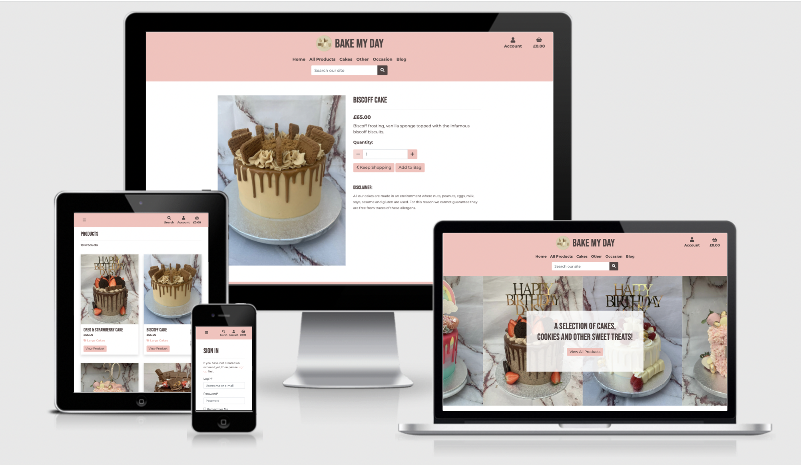
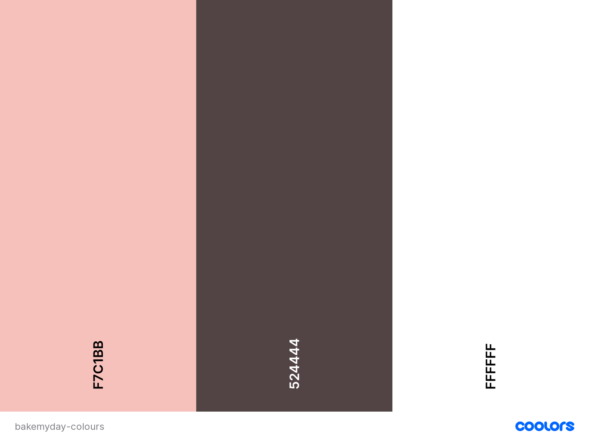
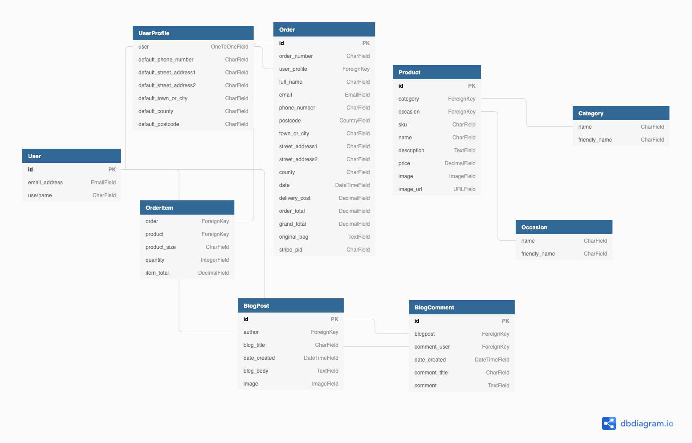

# Bake My Day

Bake my day is an online e-commerce store where users can search through all of the different products on offer and add anything that they would like to purchase to their basket.

This is a test website and uses purchases on this website are accepted via stripes test card details. You will need to use stripes test numbers.
You can find more information about this in the [stripe documentation](https://stripe.com/docs/testing). 

[Bake My Day Live Site](https://bakemydaybyamber.herokuapp.com/)



## Table of Index: 
- [UX](#ux)
   - [User Stories](#user-stories)
   - [Wireframes](#wireframes)
   - [Design](#design)
- [Features](#features)
- [Future Features](#future-features)
- [Technologies Used](#technologies-used)
- [Data Schema](#data-modelling)
- [Testing](TESTING.md)
- [Deployment](#deployment)
   - [Github cloning](#creating-a-local-repository)
   - [Heroku deployment](#heroku-deployment)
- [Credits](#credits)
 
## UX

### Target Audience

- People who need a cake for a special occasion such as Birthdays, Easter, Christmas etc. 
- People who want to order sweet treats for their friends or family during the global pandemic.
- People who want to support a local business. 

### Visitor/User goals:

- Purchase products in a safe and secure way.
- Be provided with all the necessary information regarding cake ingredients for allergen reasons. 
- Be able to easily navigate across the site and to feel comfortable doing so, easily finding what they want and need. 
- Be able to gain valuable information from the blog section.

### Site Owner Goals

- To be able to easily make any adjustments needed to any products across the website.
- For customers to get a feel for the brand and what it is through the design and layout of the website.
- For customers to not only visit the website but complete orders.
- For customers to feel they can trust the brand by providing them with as much important information as they need.

## User Stories

### Shopper

- As a shopper on bakemyday I want to be able to view all products available
- As a shopper on bakemyday I would like to be able to view product details
- As a shopper on bakemyday I would like to be able to sort products by category/occasion
- As a shopper on bakemyday I would like to be able to add a product to my basket
- As a shopper on bakemyday I would like to be able to view all the products I have added to my basket
- As a shopper on bakemyday I would like to be able to search the website and see my results
- As a shopper on bakemyday I would like to be able to easily select the quantity of what I add to my basket
- As a shopper on bakemyday I would like to recieve email confirmation after I have placed an order
- As a shopper on bakemyday I would like to be able to view my order history after placing an order
- As a shopper on bakemyday I would like to be able to checkout safe and secure
- As a shopper on bakemyday I would like to be able to get in contact with the store owner

### Site User

- As a site user of bakemyday I would like to easily register for an account
- As a site user of bakemyday I would like to easily login and logout
- As a site user of bakemyday I would like to easily be able to change my password
- As a site user of bakemyday I would to easily recover my password incase I forget it
- As a site user of bakemyday I would like to recieve email confirmation after registering
- As a site user of bakemyday I would like to be able to post blog posts
- As a site user of bakemyday I would like to be able to edit or delete a blog post I have created
- As a site user of bakemyday I would like to be able to comment on & view other users blog posts
- As a site user of bakemyday I would like to be able to get in contact with the store owner

## Wireframes

Below are all the wireframes that have been created for bakemyday. You will see that some of the wireframes do differ from the current site layout, this is just due to preference changes when seeing the project come together. From the product detail page, you can see that initially, I was planning to have an option for the user to be able to select which cake size they wanted to order. This was deprioritized and would now be a planned future feature. 

[Bake my day Wireframes](/docs/readme/wireframes/bakemyday-wireframes.pdf)

## Design 

### Typography 

The fonts chosen for this website are Bebas Neue and Montserrat the reason for this choice was because they were clean, modern and complemented each other. 

### Colour Scheme 

The main colour's chosen for the website is pink and brown as I think these complement the colours in the images used across the site and in the logo. For links and the hover colour for the Navigation bar, I chose a brown colour to match the logo and a white as a hover colour for contrast. For links and buttons throughout the same pink colour with brown writing and on the pink background on the home I have used the reverse colourway. 



## Features

#### Register account (Allauth)
- New users can register an account
#### Login to account (Allauth)
- Existing users can log in to their account
#### Session cookie 
- Once a user is logged in/ creates an account their information is stored in a session cookie until they log out
#### Personal profile page
- Displays user details and order history of a user logged in
#### Update password (Allauth)
-  Logged in users can change their password if their current password is correct and the two new passwords they enter match with allauth
#### All Products page 
- Displays all products to users
#### Categories and Occasion
- Users can select different categories of cakes in the navigation
- Users can select different occasions for cakes in the navigation
#### Single product page
- Displays specific product information to the page and allows users to add the product to the bag
#### Bag
- User can add any product to the bag from the product detail page
- Bag stores all of the user's items that they have added in one place
#### Checkout
- User can checkout as a guest or logged-in in user 
- Users can see a preview of their bag at checkout before they proceed with payment
- User will receive an email confirmation when checkout is successful and be redirected to a checkout success page
#### Stripe Payments
- Users can checkout using secure stripe payments (please note this is only set up for test numbers at the moment more details can be found:)
- Test number is in the stripe documentation mentioned at the start of the readme 
#### Toast messages
- Displays success, information, warnings and error messages from backend to user across the site
#### Search
- All users can search products by name and description
#### Blog
- A place where users and admin can create blog posts to share with others
- Only logged in users can create blogposts
#### Edit Blogpost
- Prefilled form with all blogpost details
- If a user has created the blogpost they can edit it via the form
- Changes are display to the user straight away
#### Blog Comments
- Logged in users can create blog comments on different blogposts
#### Edit Blog Comment 
- Prefilled form with blog comment details.
- If the user has created the blog comment then they can edit it via the form.
- Changes are displayed straight away.
#### Navigation bar
- All users have a navigation bar however, different links are displayed to users that are logged in
#### Footer   
- Across all pages contains the contact link, social links and location
- Social links go through to bakemyday Instagram account
#### Admin 
- Admin account can create, read, update or delete any product, blogposts or blog comments on the website if needed
   - Add product page displays only for admin users
   - Loads an empty form with all necessary fields needed to add a new product to the website
   - Edit product page displays also only for the admin user
   - Loads a prefilled form with all product details that the admin can adjust if needed
#### Error Pages
- 404 page not found, 500 internal server error and 405 method not allowed custom pages which redirect back to the homepage
#### Responsive design 
- Website is optimized for multiple screen sizes
#### Homepage 
- Provides users with an insight into what the website is about
#### Accessibility
- Website is accesible for screenreaders
 
## Future Features

- Personalisation for each product on page
- Social account login
- Multiple images per product
- Pagination
- Discount System
- Form where users can personalise a cake and generate an order
- Customer can select what size cake/how many cupcakes they would like to purchase and price will update accordingly

## Data Modelling 

Heroku PostgreSQL has been used to host the backend database in production. The database used during development of the app is SQLite.

Below are all the models used for this project. This different models within this project map to a table in the project’s database, with each of its attributes corresponding to a specific column in that table.

The data schema was planned using [dbdiagram.io](https://dbdiagram.io/home).



## Key Models

### UserProfile

- The UseProfile is created on registration for each user and the Foreiign key in this model is the User model that is created by Allauth when a user registers an account.
- The UserProfile stores the default fields which will populate if a user has saved information at checkout, this pre-populates shipping details when a user order's again.

### Order and Order Item

- The Order model is connected to the UserProfile model, allowing the user to view all their previous orders.
- The Order model acts as a container for the order items. Although the item is stored within the OrderItem model, having them connected allows retrieving the item purchased.

### Blog Post 
- The BlogPost model is connected to the User model from allauth to generate the author of the blog post. 
- The BlogPost model holds all information for the blogpost.

### Blog Comment
- The BlogComment model is connected to the BlogPost model to link comments to relevant blogpost that a user is commenting on
- The BlogComment is also connected to the User model from allauth to generate the author of the comment.
- When the blogpost is deleted, the comments connected to it will also delete in the database.

### Product, Category and Occasion

- The Product model holds all information for each product on the website (name, description, occasion, category, sku, price).
- The Foreign keys within this model are to Category model and Occasion Models which attachs a specific categoy or occasion to a product which in turn allows a user to filter products by category and occasion in navigation.
- The relationship to the Occasion Model and Category Model are purley for description purposes.

### Contact

- The contact model holds the information for when a user completes the contact form (name, email, subject line and contact message)

## Technologies & Tools Used

The following Python modules were used on this project
- Python 3.8.2
   - asgiref==3.3.4
   - boto3==1.19.3
   - botocore==1.22.3
   - dj-database-url==0.5.0
   - Django==3.2.7
   - django-allauth==0.44.0
   - django-crispy-forms==1.11.2
   - django-storages==1.12.2
   - gunicorn==20.0.4
   - jmespath==0.10.0
   - oauthlib==3.1.0
   - Pillow==8.3.2
   - psycopg2-binary==2.8.6
   - PyJWT==2.0.1
   - python3-openid==3.2.0
   - pytz==2021.1
   - requests-oauthlib==1.3.0
   - s3transfer==0.5.0
   - sqlparse==0.4.2
   - stripe==2.60.0

- [HTML](https://developer.mozilla.org/en-US/docs/Web/HTML)
- [CSS](https://developer.mozilla.org/en-US/docs/Learn/Getting_started_with_the_web/CSS_basics)
- [Heroku](https://id.heroku.com/login)
- [Bootstrap]()https://getbootstrap.com/
- [Git](https://git-scm.com/)
- [GitHub](https://github.com/)
- [Font Awesome](https://fontawesome.com/) 
- [Google fonts](https://fonts.google.com/) 
- [Balsamiq](https://balsamiq.com/) 
- [Gimp](https://www.gimp.org/) 
- [W3Schools](https://www.w3schools.com/) 
- [StackOverflow](https://stackoverflow.com/) 
- [Coloors](https://coolors.co/) 
- [JShint](https://jshint.com/) 
- [W3cValidator](https://validator.w3.org/)
- [ibb](https://ibb.co/1LvgMHM) To store images for image URL for fixtures
- [Google chrome developer tools](https://developer.chrome.com/docs/devtools/)
- [AWS S3 Bucket](https://aws.amazon.com/) - To host images for heroku site
- [Heroku Postgress](https://www.heroku.com/postgres)

### Databases
- SQlite3
- Heroku Postgress

## Testing

All the testing carried out for Bake My Day can be found [here.](TESTING.md)

## Deployment

### Creating a local repository:

In order to run this on your local IDE you need to insure you have the following installed on your machine:

- PIP
- Python
- Git
- You will also need an account on Heroku

To deploy your own version of this website, you will need to clone a local copy of the repository. To do this you need to follow the following steps.

- Click on the 'Code' button next to 'Add a file' when you have opened a repository
- To clone your repository by https:// click on the clipboard icon next to the URL.
- Once you have done this, open the terminal of your own IDE
  - The current directory will need to be changed to where you want your cloned directory.
- Type ```git clone https://github.com/Alicepinch/bakemydaybyamber.git``` into your terminal.

(There are other ways that you can clone a repository and these can be found on the [GitHub docs.](https://docs.github.com/en/github/creating-cloning-and-archiving-repositories))

Once the repository is cloned you will need to ensure that all the packages needed to run this app are installed. To install all packages from requirements.txt file using the following command in terminal.
``` pip3 -r requirements.txt ```

In your local IDE create a file called env.py.
Inside the env.py file create the following environment variables: 

``` 
os.environ.setdefault("SECRET_KEY", "{YOUR SECRET KEY}")
os.environ.setdefault("STRIPE_SECRET_KEY", "{YOUR STRIPE SECRET KEY}")
os.environ.setdefault("STRIPE_WH_SECRET", "{YOUR WH SECRET KEY}")
os.environ.setdefault("SECRET_PUBLIC_KEY", "{YOUR PUBLIC KEY}")
os.environ.setdefault("DEVELOPMENT", "True")

```

**As some of this information is sensitive, be sure to create a ".gitignore" file and add "env.py"**

### Heroku deployment:

This repository can now be deployed to Heroku:

To deploy this project to Heroku you will need a Heroku account.
Once you have an account please follow the below steps. 

Before you deploy to heroku make sure you have dj_database_url and psycopg2 installed. To do this then enter the below into your terminal :

```
pip3 install dj_database_url
pip3 install psycopg2

```

1. In Heroku create a new app and set the region to EU. 
2. Next you want to Login to the Heroku CLI ```heroku login -i``` 
3. Run migrations on Heroku Postgres - ```Heroku run python manage.py migrate```
3. Then Create a superuser - ```python manage.py createsuperuser``` 
4. Install gunicorn ```pip3 install gunicorn```
5. In your GitHub project create a requirements.txt file using the terminal command ```pip3 freeze —-local > requirements.txt ``` (This is so Heroku can read all of the web apps that have been used in the project)

6. Create a Procfile by typing ``` echo web: python app.py > Procfile``` into the terminal.

7. You will need to disable Heroku from collecting static files in your terminal with ```heroku config:set DISABLE_COLLECTSTATIC=1 --app <your-app-name>```

8. Then add all files to GitHub by typing 'git add .' into the terminal to stage all of your files. Then ```git commit -m "<message here>``` to commit the changes ready to be pushed to GitHub.

9. When all your files are ready to be pushed to GitHub, type ```git push``` in the terminal.

10. Back on your Heroku dashboard for your application, go to 'Deploy'.

11. Within this section, scroll down to 'Deployment method' and select 'Connect to GitHub'

12. In the 'Connect to GitHub' section below - search for the GitHub repository name. When you see the repository name click on the 'Connect' button.

13. Confirm the linking of the Heroku app to the correct GitHub repository.

14. In the heroku dashboard for the application, click on "Settings" > "Reveal Config Vars".

15. In the fields fill out the following:

| Key | Value |
 --- | ---
DEBUG | FALSE
IP | 0.0.0.0
DISABLE_COLLECTSTATIC |	1 
SECRET_KEY | `<your_secret_key>`
SECRET_KEY | `<your_secret_key>`
STRIPE_SECRET_KEY | `<your_stripe_key>`
STRIPE_PUBLIC_KEY| `<your_stripe_secret_key>`
SECRET_WH_KEY | `<your_webhook_secret_key>`

16. Back in your terminal the next time you add, commit and push any of your changes this will automatically deploy to Heroku

### AWS S3 Bucket

1. Go to Amazon AWS and create a new account
2. In apps search for S3 and create a new bucket 
   - Name your bucket to match Heroku to name
   - Select region close to you
   - Allow public access to files
3. Open bucket settings and allow static website hosting 

4. Under Permissions > CORS Configuration
   - In the permission tab, add in below cors configuration to set up required access for the Heroku app and S3 bucket:
```
[
  {
      "AllowedHeaders": [
          "Authorization"
      ],
      "AllowedMethods": [
          "GET"
      ],
      "AllowedOrigins": [
          "*"
      ],
      "ExposeHeaders": []
  }
]
```
5. Under Permissions > Bucket Policy
   - Generate Bucket Policy 
   - Allow all principles using a * and set AWS action as 'Get Object'
   - Copy ARN from AWS into bucket policy in the ARN Box
   - Add Statement then generate policy
   - Copy policy into bucket policy generator 
   - Add the end of the resource key add /* to allow access to all resources and save policy
6. Under Access Control Tab 
   - In the public access section set 'List Objects Permission' to 'everyone'

#### AWS IAM (Identity and Access Management):

- In AWS Service menu open IAM 
- Create a group for a user to live in
- Go to JSON Tab and 'Import managed policy'
- Import S3 Full access policy 
- Copy Bucket policy ARN and paste it into S3 Full access policy 'Resource' 
- Create policy
- Navigate back to group that was created
- Attach policy to group that we created
- On users page create user with progammatic access
- Add user to group
- Download CSV file which contains users access key and secret access key
- Make sure you save this as you can't download these again

#### Connect Heroku to AWS 

- Install boto3 and django-storages
```
pip3 install boto3
pip3 install django-storages
pip3 freeze > requirements.txt
```
- Add the secret key and access key from the .csv file to Heroku Config Vars
- Set 'USE_AWS' to true for Heroku to fetch files from AWS
- Delete DISABLE_COLLECTSTATIC variable from Config Variables and deploy Heroku app
- The variables in heroku should look like:

| Key | Value |
 --- | ---
DEBUG | FALSE
IP | 0.0.0.0
SECRET_KEY | `<your_secret_key>`
SECRET_KEY | `<your_secret_key>`
STRIPE_SECRET_KEY | `<your_stripe_key>`
STRIPE_PUBLIC_KEY| `<your_stripe_secret_key>`
SECRET_WH_KEY | `<your_webhook_secret_key>`
USE_AWS | TRUE
STRIPE_PUBLIC_KEY| `<your_stripe_secret_key>`
SECRET_WH_KEY | `<your_webhook_secret_key>`
AWS_ACCESS_KEY_ID | `<your_aws_acess_key>`
AWS_SECRET_ACCESS_KEY | `<your_aws_secret_key>`

## Credits

All images and content have been taken from the [@bakemyday_byamber](https://www.instagram.com/bakemyday_byamber/) Instagram account. 
I have full permission to use all images and all branding for this website from the owner of this business. 
- CI Slack Community
-

## Codes

- [Django Central](https://djangocentral.com/building-a-blog-application-with-django/) was used to help build the blog app
- [Ordinary Coders](https://ordinarycoders.com/blog/article/build-a-django-contact-form-with-email-backend) was used to help build a contact app