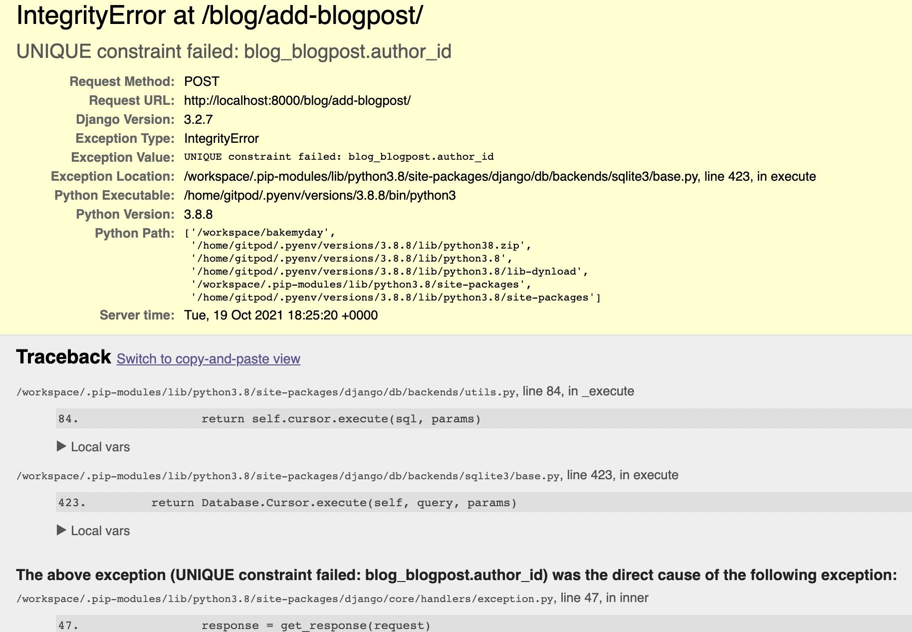

## User Stories Tested:

### Shopper

- As a shopper on bakemyday I would like to be able to view all products available
    - A shopper can view all products by navigating to the 'All products' tab in the navigation
- As a shopper on bakemyday I would like to be able to view product details
    - A shopper can view product details by clicking on any product, they will be taken to the corresponding product detail page where there is more information in here
- As a shopper on bakemyday I would like to be able to sort products by category/occasion
    - A shopper can either shop for occasion (Christmas etc.) or Category (Birthday etc.) by navigating to the tab's within the navigation. Once clicked a drop down appears that a shopper can select from.
- As a shopper on bakemyday I would like to be able to add a product to my basket
    - A shopper can add any product to their basket on it's product detail page by using the 'Add to Bag' CTA
- As a shopper on bakemyday I would like to be able to view all the products I have added to my basket 
    - A shopper can view all products that they have in their basket by navigating to the basket in the top right corner of the page. This takes them to the basket where it lists all their products and quantities
- As a shopper on bakemyday I would like to be able to search the website and see my results
    - A shopper can search the website from any page that they are on, if a product matches their search request then the product will appear
- As a shopper on bakemyday I would like to be able to easily select the quantity of what I add to my basket
    - A shopper can increase the quantity either on the product detail page or in their basket and get up to date total pricing
- As a shopper on bakemyday I would like to recieve email confirmation after I have placed an order
    - A shopper recieves an order confirmation to their chosen email address when they have successfully checked out
- As a shopper on bakemyday I would like to be able to save my account details and create an account
    - A new shopper can chose to create an account in the checkout to save their checkout information for next time
- As a shopper on bakemyday I would like to be able to view my order history after placing an order
    - If a shopper has decided to create an account then their order history will be saved automatically to their profile
- As a shopper on bakemyday I would like to be able to checkout safe and secure
    - When a shopper checks out they are using Stripe which allows safe and efficient processing of funds
- As a shopper on bakemyday I would like to be able to contact the owner incase of any questions
    - A user can contact the site owner by navigating to the contact link at the bottom of the page and submitting the form


### Site User

- As a site user of bakemyday I would like to easily register an account
    - A user can easily register an account by navigating to the 'My Account' in the top right corner, this presents the user with a drop down where they can click on register, they are then taken to a register form to set up their account
- As a site user of bakemyday I would like to easily login and logout
    - A user can login to their account by navigating to the 'My Account' in the top right corner, once they click on login they are taken to the login page to enter their email address and password
- As a site user of bakemyday I would like to easily be able to change my password
    - Once a user is logged in then they can navigate to their 'Profile' page, in here they have a CTA called 'Change password' this takes them to a form where they have to fill in their current password to update it to a new one
- As a site user of bakemyday I would to easily recover my password incase I forget it
    - A user can recover their password on the login page if they have forgotten this by clicking on 'Forgotten Password'
- As a site user of bakemyday I would like to recieve email confirmation after registering
    - Once registering an account a user will be sent an email to confirm that they want to register an account
- As a site user of bakemyday I would like to be able to post blog posts
    - A user can post a blog post by navigating to 'My Account' in the top right corner and clicking on 'Create a blogpost' in the drop down
- As a site user of bakemyday I would like to be able to edit or delete a blog post I have created
    - A user can edit/delete a blog post they have created by navigating to the blog post itself and clicking on either the 'Edit Blogpost' or 'Delete Blogpost' CTA's
- As a site user of bakemyday I would like to be able to comment on & view other users blog posts
    - A user can comment on any other blogpost by navigating to a blog post and scrolling down to the 'Comments' section and clicking on the 'Create a Comment' CTA, a user can only comment if they are logged in
- As a site user of bakemyday I would like to be able to view other blog posts that other users have posted
    - A user can view all blog posts on the website by navigating to the 'Blog' tab in the navigation
- As a site user of bakemyday I would like to be able to contact the owner incase of any questions
    - A user can contact the site owner by navigating to the contact link at the bottom of the page and submitting the form

### Admin Rights Tested:

- To be able to make any adjustments needed to any products across the website.
    - An admin can edit any product on the website by clicking on the relevant product and then clicking on the 'Edit Product' CTA
- To be able to remove any products from the website
    - An admin can delete any product on the website by clicking on the relevant product and then clicking on the 'Delete Product' CTA
- To be able to make any adjustments needed to any blogposts across the website.
    - An admin can edit any blog post on the website by clicking on the relevant post and then clicking on the 'Edit Blogpost' CTA
- To be able to remove any blogposts from the website
    - An admin can delete any blog post on the website by clicking on the relevant blogpost and then clicking on the 'Delete Blogpost' CTA
- To be able to make any adjustments needed to any comments on blog posts.
    - An admin can edit any blog comment on the website by clicking on the relevant post and then clicking on the 'Edit Blog Comment' CTA
- To be able to remove any blog comments from blog posts incase they are innapropriate
    - An admin can delete any blog comments on the website by clicking on the relevant post and then clicking on the 'Delete Blog Comment' CTA
- To be able to add new products to the website
    - An admin can add any new product by navigating to the 'My Account' in the top right corner and clicking on 'Add Product' in the drop down
- To be able to view all contact forms that come through the contact page
    - All contact forms will go through to the owners email address, they can also be viewed in the admin section of the django app
    
## Usability Testing

iPhone 11 Plus
- Safari
- Chrome

MacBook Pro 13"
- Safari
- Chrome
- Firefox
- Microsoft Edge

iMac
- Safari
- Chrome
- Firefox
- Microsoft Edge

## W3C Validators:

### W3C HTML Validator:

0 Errors
0 Warnings


### W3C CSS Validator

0 Errors


### JSHint

JavaScript code passed through JShint with no major issues. Once run through, it prompted to add some semicolons that were missing. These were all added in where necessary.

0 Errors
1 Undefined variable stripe

### Python Testing

Flake8 extension was used to test that python code was compliant with PEP8. 
Any remaining errors are outlined below:

- Error 'variable 'e' not being used' is because 'e' is a variable that is used to capture any errors from the Stripe webhook handler.
- Error './checkout/app.py - 'checkout.signals' imported but unused' is because the import is just to let Django know that there is a signal listening for changes to automatically updating the totals
- Error 'line too long (80 > 79 characters)' in the webhook handler file cannot be shortened without breaking the code.
- Error './checkout/views.py:79:80: E501 line too long (81 > 79 characters)' also cannoy be shortened without breaking the code.

Please note for the following file errors have been ignored as these were generated by Django:
    - Migration files.
    - Project setting.py
    - ./manage.py
    - checkout/init.py

Some 'Avoid' errors were raised such as 'Avoid using null=True on string-based fields such CharField.' These were also ignored as these have "Blank=True" and if I am going to allow these fields to be blank in the form, then I need the database to allow NULL values for that field.

## 404, 500 Errors

If a user tries to access a page that is non existent then they will be directed to the custom 404 page. On this page there is a CTA that redirects the user back to the homepage. I have forced this error by typing a wrong URL into the bar.
In case of an internal server error occurring then a 500 error page has also been implemented. This looks similar to the 400 error page and has a CTA for users to click back to the homepage.

## Bugs and Fixes:

Throughout the build process of this website I used the django errors to identify any issues within my code such as templating issues and fixed these as I went. Some major bugs and issues I faced:

### Unable to create duplicate blog posts:

During the build to blog app of bakemyday I came across the error of a User not being unable to create more than one blogpost at a time. Every time I went to submit another blog post the below error would appear:



After getting multiple people to check if there was something wrong with my code and no one being able to find the error I decided to remove my database and all migrations. In order to do this I deleted my db.sqlite3 folder and then all migrations folders in each app. I then rerun all migrations to reinstate my database which fixed the issue.  

### Django Warnings

After not updating my Django and sqlparse for a long time github was giving me an error the some security dependencies and to upgrade Django and sqlparse. After doing this I was faced with the below warnings: 

In order to fix this I added in ```DEFAULT_AUTO_FIELD = 'django.db.models.BigAutoField``` into my settings file

### Internal Server Error on Heroku

After I had deployed my app to heroku I was faced with an Internal Server Error every time I opened the app. The issue was that I had changed my models but hadn't applied my migrations to the heroku app. To fix this I entered the following command into the terminal:

```heroku run python3 manage.py migrate -a 'heroku-app-name'```

### Blog

When testing the add blog functionality I noticed that a user could add a blog post with no title, this isn't the best user experience as a specific blog title tells a user what questions are being answered as well as an insight into the information you're providing.

To fix this I changed the my blog model from:

```blog_title = models.CharField(max_length=60, null=True, blank=False)```

To:

```blog_title = models.CharField(max_length=60, null=True, blank=True)```

I also noticed that the blog posts were not displaying in order of them being created. In order to fix this I added in a meta option for the blog model:

```class Meta: ordering = ['-date_created']```

When adding a new blogpost to the blog the success message was still showing the bag when it had been uploaded succesfully. To fix this issue I updated the messages to be info rather than success.

When testing the blogpost functionality I realised that the blog preview section was not mandatory and that if someone didn't add this in then the template would return 'None'. To fix this I could have made this mandatory however, I thought it would make more sense to remove one step for a user and just take the preview from the blog body itself. I removed 'blog_preview' from the BlogPost model and then added in ```{{blogpost.blog_body|slice:":200" }}``` into my template to pull in a preview of the blog content on the blog page. 

When testing the edit blog post functionality, it wouldnt let a super user edit another users blogpost. This isn't ideal incase someone has posted something inappropriate the admin should be able to edit this. 

To fix this I updated my code in the blog views from:
```
if not request.user.is_superuser or request.user != blogpost.author:
        messages.error(
            request, 'Sorry, you didnt create this \
                blogpost so you cant edit it')
        return redirect(reverse('home'))
    # Updates blogpost in database
    if request.method == 'POST':
        form = BlogForm(request.POST, request.FILES, instance=blogpost)
        if form.is_valid():
            form.save()
            messages.info(request, 'Successfully updated blog post!')
            return redirect(reverse('blog_detail', args=[blogpost.id]))

```

To:

```
    if request.user == blogpost.author or request.user.is_superuser:
        # Updates blogpost in database
        if request.method == 'POST':
            form = BlogForm(request.POST, request.FILES, instance=blogpost)
            if form.is_valid():
                form.save()
                messages.info(request, 'Successfully updated blog post!')
                return redirect(reverse('blog_detail', args=[blogpost.id]))
            else:
                messages.error(
                        request, 'Failed to update the blog post. \
                            Please make sure form is valid')
        else:
            form = BlogForm(instance=blogpost)
    else:
        messages.error(
                request, 'Sorry, you didnt create this \
                    blogpost so you cant edit it')
        return redirect(reverse('home'))

```

### Save Info:

When testing the save info to profile functionality during the building process I noticed this wasn't working, after some investiation I noticed that there were a couple of spelling errors within my file in the def cache_checkout_data view and def checkout and checkout success and ```('save-info')``` was updated to ```'save_info'```

## Unsolved bug's due to prioritization:

- Deleting a product which has been purchased will delete an orders item this means that the order history will not display any information.
- Users cart is not saved if they log out of their account.

## Manual Functionality Testing

#### Navbar - PASS

- All links, including logo are working as expected, and takes the user where they want to go.
- Search bar is working and lets a user search through products, categories, product details and occasion. If user input is empty a "You didn't enter anything!" message is shown.
- Account links work as expected, and succefully directs user to Register, Login, Profile, and Add product page's. Logout link successfully logs out user.
- All Products works as exptected and shows the user all products
- Occasion and Category links generate a drop down with all the different occasions and categorys for users to look through
- Shopping bag link works, and updates successfully when user adds or removes a product from/to the bag, and updates the grand total accordingly.
- Navbar condenses down succesfully for mobile view.

#### Homepage - PASS

- CTA button's on homepage work as expected and take users to products page and blog page

#### Register - PASS

- Form input and validations work as expected. Form gives feedback upon unmatched format, invalid data, or for existing user
- Submit button works as expected and submits data successfully, and send verification e-mail for users to confirm their email address.
- Email confirmation email works correctly and directs user to the confirm user page where they can verify their email
- Once email is verified user can succesfully login

#### Login - PASS

- Form input and validations work as expected. Form gives feedback if any unmatched format's or incorrect username, email and password, or if user doesn't exist in the database.
- Submit button works as expected if user is in database, this then redirects user to homepage with a success toast message.
- 'Forgot password' link works as expected and takes user to password recovery page.

#### Profile - PASS

- All recent purchases are shown in the Order History tab.
- All recent purchase links works as expected and open in a new page with the past order information.
- User details form works as expected, and successfully updates user details.

#### Logout - PASS

- Logout functionality is working as expected. This logs the user out and removes session cookies.

#### Products - PASS

- Products page works as expected and displays all products in the database.
- Category tag's work and explains to customer what category the products is.
- When a product is clicked it succesfully takes you to the correct product detail page

#### Product Detail - PASS

- Page renders the specified product details of the product that was clicked on the product page.
- Quantity input buttons work as expected, increments product quantity by specified amount between 1-5.
- Keep shopping CTA works as expected and takes the user back to Products page.
- Add to bag CTA works as expected and adds the item and its quantity into the shopping bag and returns a success message with a preview of the bag.
- Edit Product and Delete Product CTA's display for admin user's only and work as expected. 
- Delete modal is displayed when trying to delete product as a precaution layer
- Edit Product CTA directs user to a edit product page

#### Edit Product - PASS

- Page works as expected and renders a prefilled form with product details in
- Admin can successfully update all aspects of the product from the form
- Update Product CTA successfully updates product data in database and redirects back to the product page where changes are reflected
- Cancel CTA succesfully redirects back to products page
- Field validators are working, user can't submit form if all required fields are not filled. 

#### Add Product - PASS

- Page works as expected and renders the same form as edit product but with empty fields
- Add Product CTA successfully adds product into database and redirects back to products pages 
- Cancel CTA succesfully redirects back to products page
- Field validators are working, user can't submit form if all required fields are not filled

#### Bag - PASS

- Page works as expected and renders all items in a users bag with some product details
- Remove button works and removes item from bag
- Quantity input works correctly and user can increase quantity of product in their bag with 'Update'
- Grand total, and delivery are visible and reflect any changes that are made on the bag page
- Keep shopping button works as expected and redirects user back to Products page
- Secure Checkout button works as expected and directs user to the Checkout Page

#### Checkout - PASS

- Page works as expected and renders all items in bag in the order summary section
- Checkout form works as expected and successfully submits data for payment
- Checkout form validation works as expected and gives feedback if any format is unmatched or incorrect inputs
- If save info is selected then checkout form sucessfully saves, and updates user data for them to use later
- If user doesn't have an account or isn't logged in then save info is replaced by 'Create an account or login' these links succesfully redirects to the register account page and login page
- Upon successful payment, a confirmation e-mail is sent to user with their order details.

#### Checkout Success - PASS

- Page works as expected, it renders and and summarizes the order for customers with their confirmation number. A success message is displayed in top right corner with order confirmation
- Email is sent to email address used for the order with order confirmation

#### Blog - PASS

- Page works as expected, and renders all the blog post data from database.
- All post images, titles, and read more links work as expected and takes the user to the post page.

#### Blog Detail - PASS

- Successfully renders all the blog post data 
- Comment section works as expected and displays all the comments associated with blogpost with a comment counter. If there are no comments on the post, a message is shown to the user if they would like to add one.
- 'Add a comment' CTA links user succesfully through to comment form, if user is not logged in they will be redirected to login page
- Edit Blog Post and Delete Blog Post CTA's only display for admin user's or the author of the blogpost and work as expected. 
- Delete modal is displayed when trying to delete blog post as a precaution layer
- Delete CTA in modal succesfully removes blog post from database
- Edit Blogpost CTA redirects user to a edit blogpost page
- If a user who created a comment is logged in then 'Delete Comment' and 'Edit Comment' CTA's are displayed 
- 'Delete Comment' CTA deletes comment 
- 'Edit Comment' redirects user to edit comment page

#### Add Blog Post - PASS

- Page works as expected and renders blog post form with empty fields
- 'Add Blog Post' CTA successfully adds blogpost into database and redirects back to blog page where this is displayed
- Cancel CTA succesfully redirects back to blog page
- Field validators are working, user can't submit form if all required fields are not filled/invalid.

#### Edit Blog Post - PASS

- Page works as expected and renders blog post prefilled with blog post data
- 'Update Blog Post' CTA successfully updates blogpost data in database and redirects back to blog page where this is displayed
- 'Cancel' CTA succesfully redirects back to blog page
- Field validators are working, user can't submit form if all required fields are not filled/invalid.

#### Blog Comment - PASS

- Page works as expected and renders blog comment form with empty fields
- 'Add Blog Comment' CTA successfully adds comment into database for relevant blog post and redirects back to blog post where this is displayed
- 'Cancel' CTA succesfully redirects back to blog page
- Field validators are working, user can't submit form if all required fields are not filled/invalid.

#### Contact - PASS

- Page works as expected and renders the contact form
- 'Submit' CTA submits contact form and sends directly to the store owners email address
- 'Cancel' CTA redirects user back to homepage
- Success message renders after succesful form submission letting the user know someone will be in touch shortly

#### Footer - PASS

- Footer is available across all pages.
- Quick links work as expected, and redirects user to the specified page.
- Social link on the footer works as expected, and link opens in a new tab.

#### Error 404 - PASS

- Works as expected, successfuly captures and handles page not found error.
- Go back button on error page works as expected and redirects user back to the homepage.

#### Error 500 - PASS

- Works as expected, successfuly captures and handles internal server error.
- Go back button on error page works as expected and redirects user back to the homepage.

#### Stripe Webhooks - PASS

Webhooks work as expected, and give a 200 code.


A confirmation email is sent to customer when a checkout is successful and appears as below:


Authentication works correctly when stripe test number is used at checkout:


## Notes

Git commit: 6b66b7f81d052d42873224147e38fecd9833ff7c was a large commit due to deleting database and migrations due to a database issue meaning I couldnt create multiple blog posts. Also included was changes to allauth templates which should have been split up into two or three commits. A whole commit was done by accident.